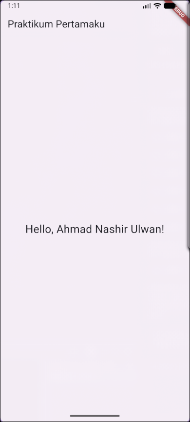

# 📱 Mobile Programming – Modul 1
**Pengenalan Lingkungan Pengembangan Android dengan Flutter**

## 👤 Identitas
- **Nama**: Ahmad Nashir Ulwan  
- **NIM**: 230605110122  
- **Kelas**: B  

---

## 🎯 Tujuan
- Mengenal dasar penggunaan **Flutter**.  
- Menjalankan aplikasi default dari template `flutter create`.  
- Memodifikasi teks pada AppBar dan Body.  
- Menguji aplikasi di **emulator Android** dan **smartphone nyata**, lalu membandingkan waktu eksekusi.  

---

## 📝 Ringkasan Tugas
Berikut langkah-langkah penyelesaian tugas modul 1:

1. **Menjalankan aplikasi bawaan Flutter (Counter App)** hasil dari `flutter create`.  
2. **Memodifikasi file `main.dart`:**  
   - AppBar diubah menjadi **"Program Pertamaku"**.  
   - Body diubah menjadi teks **"Hello, Ahmad Nashir Ulwan!"**.  
3. **Menjalankan aplikasi di Emulator Android** untuk melihat hasil modifikasi.  
4. **Menjalankan aplikasi di Smartphone nyata** melalui USB Debugging.  
5. **Mencatat waktu eksekusi**:  
   - Emulator: **48.6 detik**  
   - Smartphone: **22.1 detik**  
   - Perbedaan terjadi karena emulator berjalan di atas virtualisasi sehingga lebih lambat dibanding perangkat fisik.  

---

## 📸 Screenshot Hasil
Hasil tampilan aplikasi setelah modifikasi:  

---

## ✅ Kesimpulan
- Flutter menyediakan template awal (Counter App) yang mudah dijalankan.  
- Modifikasi kode sederhana berhasil mengubah tampilan AppBar dan teks Body.  
- Aplikasi dapat berjalan di emulator maupun smartphone nyata.  
- **Smartphone lebih cepat** dalam eksekusi aplikasi dibanding emulator karena tidak ada lapisan virtualisasi.  
