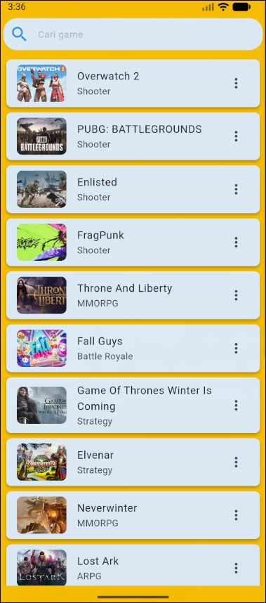
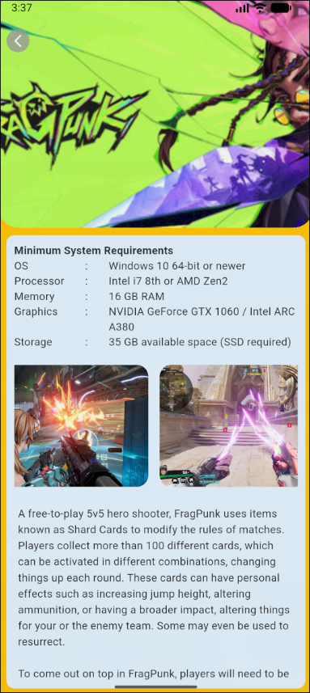

# 📱 Mobile Programming – Modul 10
**Desain GUI, Navigasi, dan Integrasi API Lanjutan**

## 👤 Identitas
- **Nama**: Ahmad Nashir Ulwan
- **NIM**: 230605110122
- **Kelas**: B

---

## 🎯 Tujuan
- Merancang GUI yang interaktif dan responsif menggunakan berbagai widget Flutter.
- Menerapkan navigasi *named route* yang terstruktur.
- Membuat kelas model dan mengimplementasikan JSON serialization/deserialization otomatis dengan `json_serializable`.
- Mengintegrasikan data dari API ke dalam antarmuka aplikasi dengan dinamis.

---

## 📝 Ringkasan Tugas
Langkah-langkah pengerjaan tugas aplikasi daftar game yang lebih kompleks:

1.  **Struktur Proyek (MVVM)**: Proyek diatur dengan arsitektur MVVM, memisahkan kode ke dalam folder `view` (UI), `viewmodel` (logika bisnis & data fetching), dan `model` (struktur data).
2.  **Konfigurasi Dependensi**: Menambahkan paket `http`, `json_annotation`, `readmore`, `build_runner`, dan `json_serializable` ke `pubspec.yaml`.
3.  **Model Data & Serialization**:
    -   Membuat class model `Game` (untuk daftar game) dan `DetailGame` (untuk detail) di dalam folder `model`.
    -   Menambahkan anotasi `@JsonSerializable()` dan menjalankan `flutter pub run build_runner build` untuk menghasilkan kode konversi JSON ke Dart secara otomatis.
4.  **Logika Pengambilan Data**: Di `viewmodel/fetchgame.dart`, dibuat dua fungsi utama: `fetchGames()` untuk mengambil daftar semua game dan `fetchDataFromAPI(id)` untuk mengambil detail satu game berdasarkan ID-nya.
5.  **Halaman Utama (Home)**:
    -   Menggunakan `FutureBuilder` untuk menangani proses *loading* saat mengambil data dari `fetchGames()`.
    -   Menampilkan daftar game menggunakan `ListView.builder`, di mana setiap item adalah `Card`.
    -   Setiap `Card` dibungkus `GestureDetector` untuk menangani `onTap`, yang akan bernavigasi ke halaman detail sambil mengirim `game.id` sebagai argumen.
6.  **Halaman Detail**:
    -   Halaman ini menerima `id` game yang dikirim dari halaman utama.
    -   Menggunakan `FutureBuilder` lagi untuk memanggil `fetchDataFromAPI(id)` dan menampilkan data detail seperti gambar, *system requirements*, *screenshots* (dalam `ListView` horizontal), dan deskripsi lengkap (menggunakan `ReadMoreText`).

---

## 📸 Screenshot Hasil
Berikut adalah tampilan dari halaman utama dan halaman detail aplikasi:

**Tampilan Halaman Home**

*Tampilan Halaman Home*

**Tampilan Halaman Detail**

*Tampilan Halaman Detail*

---

## ✅ Kesimpulan
- **Arsitektur MVVM**: Memisahkan logika, data, dan tampilan membuat kode lebih terstruktur, mudah dikelola, dan diskalakan.
- **JSON Serialization Otomatis**: Menggunakan `json_serializable` dan `build_runner` sangat menyederhanakan proses konversi data JSON dari API menjadi objek Dart, mengurangi boilerplate code dan potensi error.
- **`FutureBuilder`**: Merupakan widget yang sangat andal untuk menangani operasi asinkron (seperti request API), dengan menyediakan mekanisme untuk menampilkan state *loading*, *error*, dan saat data berhasil didapatkan.
- **Navigasi Terpusat**: `Named route` menawarkan sistem navigasi yang kuat dan terpusat, sangat efektif untuk aplikasi dengan banyak halaman dan alur yang kompleks.