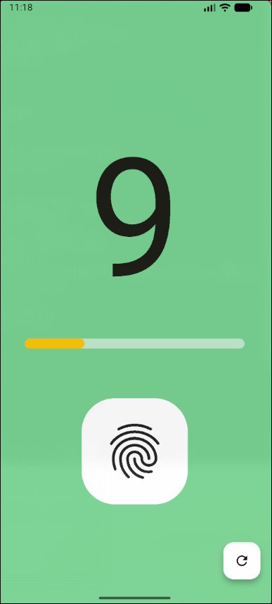

# 📱 Mobile Programming – Modul 11
**Manajemen State dengan GetX**

## 👤 Identitas
- **Nama**: Ahmad Nashir Ulwan
- **NIM**: 230605110122
- **Kelas**: B

---

## 🎯 Tujuan
- Memahami konsep manajemen state dalam Flutter menggunakan GetX.
- Menerapkan *controller* dan variabel reaktif (`.obs`) untuk memperbarui UI secara dinamis.
- Menggunakan widget `Obx` untuk memantau dan merefleksikan perubahan state secara *real-time*.
- Membandingkan pendekatan manajemen state GetX dengan `setState()` konvensional.

---

## 📝 Ringkasan Tugas
Langkah-langkah pengerjaan tugas aplikasi Tasbih Digital menggunakan GetX:

1.  **Setup Proyek**: Membuat proyek baru dan menambahkan dependensi `get` dan `simple_circular_progress_bar` ke file `pubspec.yaml`.
2.  **Membuat Tampilan (View)**: Merancang UI awal di `home.dart` secara statis, terdiri dari `Scaffold`, `Text` (untuk counter), `LinearProgressIndicator`, dan tombol-tombol.
3.  **Membuat Controller**: Membuat class `TasbihController` (di `viewmodel`) yang *extends* `GetxController`.
4.  **Variabel Reaktif**: Di dalam controller, variabel `counter` dan `progress` didefinisikan sebagai variabel reaktif dengan menambahkan `.obs` di akhir nilainya.
5.  **Logika Fungsi**: Membuat method `incrementCounter()` (untuk menambah hitungan & progress) dan `resetCounter()` (untuk mengembalikan ke nol) di dalam controller.
6.  **Menghubungkan View & Controller**:
    -   Menginisialisasi controller di `home.dart` menggunakan `Get.put()`.
    -   Membungkus widget `Text` (counter) dan `LinearProgressIndicator` dengan `Obx(() => ...)` agar menjadi reaktif.
    -   Menghubungkan `onTap` dan `onPressed` pada tombol ke method yang sesuai di controller (misal: `controller.incrementCounter` dan `controller.resetCounter`).

---

## 📸 Screenshot Hasil
Berikut adalah tampilan dari aplikasi Tasbih Digital setelah digunakan:

**Tampilan Aplikasi Tasbih (GetX)**

---

## ✅ Kesimpulan
- **GetX Mempermudah State**: GetX menyederhanakan manajemen state. UI diperbarui secara otomatis saat state berubah tanpa perlu memanggil `setState()` secara manual, membuat kode lebih ringkas.
- **Efisiensi `.obs` dan `Obx`**: Variabel reaktif (`.obs`) dan widget `Obx` bekerja sama untuk memastikan hanya bagian UI yang diperlukan saja yang di-*rebuild* saat ada perubahan data. Ini jauh lebih efisien daripada `setState()` yang seringkali me-*rebuild* seluruh *widget tree*.
- **Pemisahan Logika**: GetX mendorong pemisahan yang jelas antara logika bisnis/state (di dalam **Controller**) dan tampilan (di dalam **View**), membuat struktur kode lebih rapi, terorganisir, dan mudah diuji.