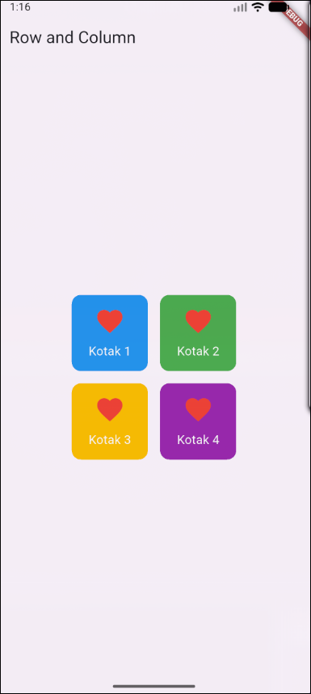

# 📱 Mobile Programming – Modul 2
**Widget Row dan Column**

## 👤 Identitas
- **Nama**: Ahmad Nashir Ulwan  
- **NIM**: 230605110122  
- **Kelas**: B  

---

## 🎯 Tujuan
- Memahami penggunaan **Row** dan **Column** pada Flutter.  
- Membuat custom widget sederhana dengan **StatelessWidget**.  
- Menyusun widget dalam tata letak horizontal dan vertikal.  
- Membuat grid sederhana menggunakan kombinasi Row dan Column.  

---

## 📝 Ringkasan Tugas
Berikut langkah-langkah penyelesaian tugas modul 2:

1. Membuat proyek baru Flutter dengan nama **row_and_column**.  
2. Mengubah judul aplikasi (`title` pada `MaterialApp` dan `AppBar`) menjadi **"Row and Column"**.  
3. Membuat custom widget **KotakBiruJempol** menggunakan `StatelessWidget` dengan `Container` biru dan ikon jempol.  
4. Menampilkan widget tersebut di dalam **Center**.  
5. Menambahkan beberapa widget dengan **Row** untuk susunan horizontal.  
6. Mengubah menjadi **Column** untuk susunan vertikal, ditambah `SizedBox` sebagai jarak antar widget.  
7. **Tugas Praktikum:**  
   - Membuat grid 2x2 dengan 4 kotak berwarna berbeda.  
   - Mengganti ikon menjadi `Icons.favorite` berwarna merah.  
   - Menambahkan teks di bawah setiap ikon dengan menggunakan **Column**.  

---

## 📸 Screenshot Hasil
Hasil tampilan aplikasi:  

---

## ✅ Kesimpulan
- **Row** → untuk menyusun widget secara **horizontal**.  
- **Column** → untuk menyusun widget secara **vertikal**.  
- Membuat custom widget dengan `StatelessWidget` mempermudah kode agar lebih rapi dan reusable.  
- Kombinasi Row, Column, Container, serta properti seperti `children`, `color`, dan `decoration` sangat fleksibel untuk membangun antarmuka yang dinamis.  
