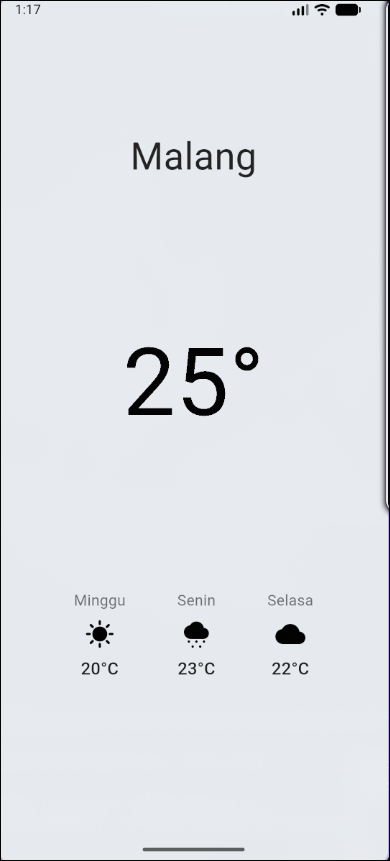

# 📱 Mobile Programming – Modul 3
**Pengaturan Layout Row dan Column di Flutter**

## 👤 Identitas
- **Nama**: Ahmad Nashir Ulwan  
- **NIM**: 230605110122  
- **Kelas**: B  

---

## 🎯 Tujuan
- Memahami perbedaan **main axis** dan **cross axis**.  
- Menggunakan properti **mainAxisSize**, **mainAxisAlignment**, dan **crossAxisAlignment** pada Row dan Column.  
- Membangun layout yang lebih kompleks dan rapi dengan kombinasi Row & Column.  
- Membuat aplikasi sederhana (contoh: **Weather App**).  

---

## 📝 Ringkasan Tugas
Langkah-langkah yang dikerjakan dalam praktikum Modul 3:

1. **Membuat proyek baru Flutter** dengan nama `alignment` dan mengganti judul menjadi **"Alignment"**.  
2. **Membuat custom widget**:  
   - `KotakBiruJempol` (100x100)  
   - `KotakBiruJempolKecil` (75x75)  
   Keduanya berupa `Container` biru dengan ikon jempol.  
3. **Eksperimen Row dan Column**:  
   - Menyusun widget horizontal dengan Row, ditambah `SizedBox` untuk jarak.  
   - Mengatur `mainAxisSize` → `max` vs `min`.  
   - Menguji berbagai variasi `mainAxisAlignment`:  
     - `start`, `end`, `center`, `spaceBetween`, `spaceAround`, `spaceEvenly`.  
   - Mengatur `crossAxisAlignment` untuk perataan vertikal/horizontal.  
   - Mencoba `CrossAxisAlignment.baseline` untuk teks dengan ukuran berbeda.  
4. **Tugas Akhir**:  
   - Membuat UI aplikasi cuaca sederhana dengan `Column` sebagai layout utama.  
   - Menggunakan `Row` untuk menampilkan prakiraan cuaca harian.  
   - Membuat custom widget **ForecastItem** agar lebih rapi dan reusable.  

---

## 📸 Screenshot Hasil
Tampilan aplikasi cuaca hasil tugas:  

---

## ✅ Kesimpulan
- **Row** dan **Column** bisa dikombinasikan untuk membangun layout fleksibel.  
- **mainAxisAlignment** efektif untuk distribusi widget di sumbu utama.  
- **crossAxisAlignment** mengatur perataan di sumbu silang.  
- Properti alignment ini penting untuk membangun UI yang rapi.  
- Dengan latihan ini, berhasil dibuat aplikasi cuaca sederhana sebagai implementasi nyata.  
