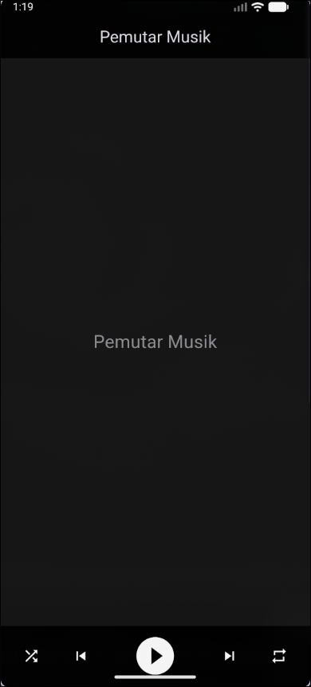

# 📱 Mobile Programming – Modul 4
**Widget Flexible dan Expanded di Flutter**

## 👤 Identitas
- **Nama**: Ahmad Nashir Ulwan
- **NIM**: 230605110122
- **Kelas**: B

---

## 🎯 Tujuan
- Memahami konsep dan implementasi widget `Flexible` dan `Expanded` dalam Flutter.
- Membedakan properti `flex` dan `fit` pada widget `Flexible`.
- Membandingkan perbedaan fungsional antara `Flexible` dan `Expanded` dalam mengatur ruang pada layout.
- Menerapkan `Flexible` dan `Expanded` untuk membangun UI yang dinamis dan responsif.

---

## 📝 Ringkasan Tugas
Langkah-langkah pengerjaan tugas **Control Bar Pemutar Musik**:

1.  **Membuat proyek baru** Flutter dan mengatur tema utama aplikasi menjadi gelap (`ThemeData.dark()`).
2.  **Membangun layout dasar** menggunakan `Scaffold` dan menempatkan sebuah `Container` di dalam properti `bottomNavigationBar`.
3.  **Menyusun ikon kontrol** di dalam `Container` dengan menggunakan `Row` yang berisi lima buah `Icon` (Shuffle, Previous, Play, Next, Repeat).
4.  **Membagi ruang secara merata** untuk empat ikon (Shuffle, Previous, Next, Repeat) dengan membungkus masing-masing ikon menggunakan widget `Expanded`.
5.  **Memberi ruang lebih besar pada ikon utama**, yaitu ikon Play, dengan membungkusnya menggunakan `Flexible` yang diberi properti `flex: 2` dan `fit: FlexFit.tight` agar ukurannya dua kali lebih besar dari ikon lainnya.
6.  **Menyesuaikan tampilan ikon** dengan memperbesar ukuran ikon Play dan memberi warna putih pada semua ikon agar kontras dengan latar belakang gelap.

---

## 📸 Screenshot Hasil
Tampilan aplikasi pemutar musik hasil tugas:

---

## ✅ Kesimpulan
- **`Flexible`** dan **`Expanded`** adalah widget yang sangat kuat untuk membuat layout yang dinamis dan responsif.
- **`Expanded`** adalah cara singkat untuk membuat widget mengisi sisa ruang yang tersedia, setara dengan `Flexible` yang menggunakan `fit: FlexFit.tight`.
- **`Flexible`** memberikan kontrol lebih besar melalui properti `fit`, yang memungkinkan widget untuk tetap pada ukuran aslinya (`FlexFit.loose`) atau dipaksa mengisi ruang (`FlexFit.tight`).
- Kombinasi keduanya memungkinkan distribusi ruang yang kompleks dan proporsional dengan mudah, seperti yang diterapkan pada tugas pemutar musik.