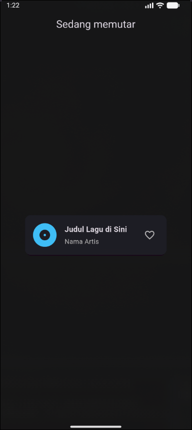

# 📱 Mobile Programming – Modul 5
**Widget SizedBox, Spacer, dan Card di Flutter**

## 👤 Identitas
- **Nama**: Ahmad Nashir Ulwan
- **NIM**: 230605110122
- **Kelas**: B

---

## 🎯 Tujuan
- Memahami fungsi dan penggunaan widget `SizedBox`, `Spacer`, dan `Card` dalam layout Flutter.
- Membedakan antara `SizedBox` untuk jarak tetap dan `Spacer` untuk jarak proporsional (fleksibel).
- Mampu mendesain antarmuka sederhana menggunakan `Card` untuk menyajikan informasi secara terstruktur.

---

## 📝 Ringkasan Tugas
Langkah-langkah pengerjaan tugas **Music Player Card**:

1.  **Membuat proyek baru** Flutter dengan tema gelap dan `AppBar` berjudul "Sedang memutar".
2.  **Menambahkan `Card`** di tengah layar sebagai wadah utama untuk menampilkan informasi lagu.
3.  **Mengisi `Card`** dengan `ListTile` untuk mengatur layout konten secara horizontal.
4.  **Menambahkan elemen-elemen** ke dalam `ListTile`:
    -   `leading`: Sebuah `Icon` untuk representasi album atau lagu.
    -   `title`: Teks untuk **Judul Lagu**.
    -   `subtitle`: Teks untuk **Nama Artis**.
    -   `trailing`: Sebuah `Icon` hati (like button).
5.  **Menyesuaikan Tampilan** dengan memberi warna dan gaya pada `Card`, `Icon`, dan `Text` agar sesuai dengan desain pemutar musik.

---

## 📸 Screenshot Hasil
Tampilan aplikasi pemutar musik hasil tugas:

*Tampilan Aplikasi Pemutar Musik*

---

## ✅ Kesimpulan
- **`SizedBox`**: Sangat efektif digunakan untuk memberikan jarak atau ukuran yang pasti dan tetap (fixed size), cocok untuk layout yang presisi.
- **`Spacer`**: Berguna untuk membuat jarak yang fleksibel dan proporsional. Ia akan mengisi sisa ruang yang tersedia berdasarkan nilai `flex`, sehingga layout menjadi lebih responsif di berbagai ukuran layar.
- **`Card`**: Berfungsi sebagai wadah (panel) untuk menyajikan informasi secara rapi dan menarik, sering kali dikombinasikan dengan `ListTile`, `Icon`, dan `Button` untuk membuat UI yang informatif dan interaktif.