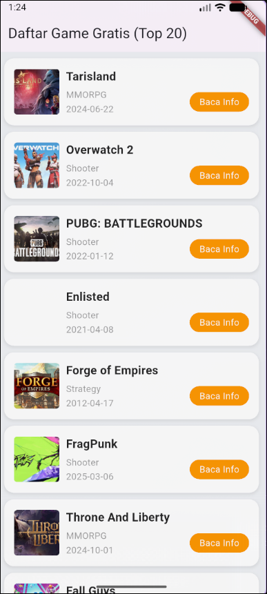

# 📱 Mobile Programming – Modul 6
**Widget GridView dan ListView di Flutter**

## 👤 Identitas
- **Nama**: Ahmad Nashir Ulwan
- **NIM**: 230605110122
- **Kelas**: B

---

## 🎯 Tujuan
- Memahami penggunaan `GridView` untuk data dalam format grid dan `ListView` untuk daftar vertikal.
- Mampu menggunakan `GridView.builder` dan `ListView.builder` untuk menampilkan data dinamis dari API secara efisien.
- Mampu membuat antarmuka interaktif menggunakan `GridTile` dan `ListTile`.

---

## 📝 Ringkasan Tugas
Langkah-langkah pengerjaan tugas **Daftar Game dari API**:

1.  **Membuat proyek baru** dan menambahkan dependensi `http` pada file `pubspec.yaml` untuk request API.
2.  **Mengubah widget utama** menjadi `StatefulWidget` agar dapat mengelola state (data dinamis).
3.  **Membuat method `_ambilData()`** untuk mengambil data daftar game dari API publik menggunakan `http.get()`.
4.  **Memanggil method `_ambilData()`** di dalam `initState()` agar data diambil secara otomatis saat aplikasi pertama kali dimuat.
5.  **Menampilkan data** menggunakan `ListView.builder` yang secara dinamis membuat `Card` untuk setiap item game.
6.  **Setiap `Card` berisi `ListTile`** yang menampilkan:
    -   `leading`: Gambar (thumbnail) game.
    -   `title`: Nama game.
    -   `subtitle`: Genre dan tanggal rilis game.
    -   `trailing`: `ElevatedButton` bertuliskan "Baca Info".

---

## 📸 Screenshot Hasil
Tampilan aplikasi daftar game gratis hasil tugas:

---

## ✅ Kesimpulan
- **`GridView`** dan **`ListView`** adalah widget fundamental untuk menampilkan koleksi data. `GridView` cocok untuk galeri, sedangkan `ListView` cocok untuk daftar yang detail.
- **`.builder` sangat efisien**: `GridView.builder` dan `ListView.builder` menggunakan mekanisme *lazy loading*, di mana item hanya dirender saat akan tampil di layar. Ini menghemat memori dan meningkatkan performa, terutama untuk data dalam jumlah besar.
- **Integrasi API**: Dengan paket `http`, Flutter dapat dengan mudah mengambil data dari internet (API). Data JSON yang diterima di-decode dan disimpan dalam state untuk ditampilkan secara dinamis di antarmuka pengguna.