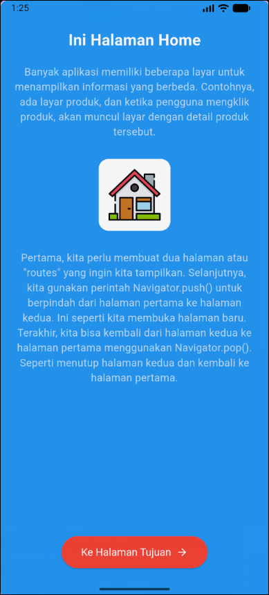
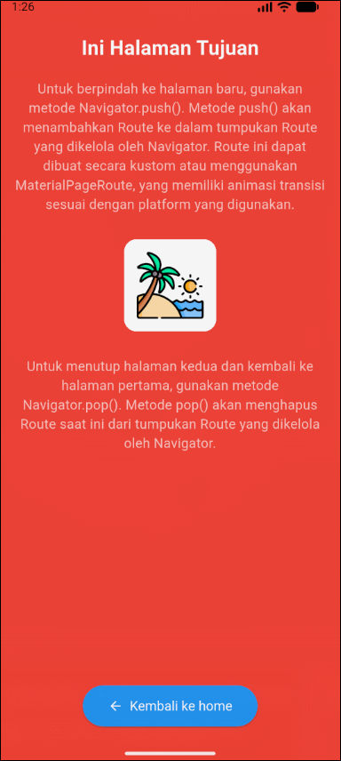

# 📱 Mobile Programming – Modul 7
**Navigasi Antar Halaman di Flutter**

## 👤 Identitas
- **Nama**: Ahmad Nashir Ulwan
- **NIM**: 230605110122
- **Kelas**: B

---

## 🎯 Tujuan
- Memahami dan mengimplementasikan navigasi antar halaman di Flutter.
- Menggunakan `MaterialPageRoute` dengan `Navigator.push()` untuk berpindah ke halaman baru.
- Menggunakan `Navigator.pop()` untuk kembali ke halaman sebelumnya.
- Menerapkan `Named Route` untuk navigasi yang lebih terstruktur dengan mendaftarkan rute di `MaterialApp`.

---

## 📝 Ringkasan Tugas
Karena pada modul ini tidak ada tugas spesifik dan hanya berisi praktikum, maka ringkasan ini menjelaskan alur kerja dari praktikum yang telah dilakukan:

1.  **Struktur Proyek**: Proyek dipecah menjadi tiga file utama: `main.dart` (untuk konfigurasi rute), `home.dart` (halaman utama), dan `tujuan.dart` (halaman kedua).
2.  **Manajemen Aset**: Membuat folder `assets` untuk menyimpan gambar dan mendaftarkannya di `pubspec.yaml`.
3.  **Konfigurasi Rute (`Named Route`)**: Di `main.dart`, `initialRoute` diatur ke halaman utama dan semua rute yang tersedia (`/home` dan `/tujuan`) didaftarkan di dalam properti `routes` pada `MaterialApp`.
4.  **Navigasi Pergi (`push`)**: Pada halaman `home.dart`, sebuah tombol dibuat untuk memicu perpindahan halaman. Saat ditekan, fungsi `Navigator.pushNamed(context, '/tujuan')` dipanggil untuk membuka halaman tujuan.
5.  **Navigasi Kembali (`pop`)**: Pada halaman `tujuan.dart`, sebuah tombol kembali dibuat. Saat ditekan, fungsi `Navigator.pop(context)` dipanggil untuk menutup halaman saat ini dan kembali ke halaman sebelumnya (halaman home) dalam tumpukan navigasi.

---

## 📸 Screenshot Hasil
Berikut adalah tampilan dari kedua halaman yang dibuat dalam praktikum:

**Halaman Utama (Home)**

*Tampilan Halaman Utama (Home)*

**Halaman Tujuan**

*Tampilan Halaman Tujuan*

---

## ✅ Kesimpulan
- **`Named Route`**: Sangat cocok untuk aplikasi skala menengah hingga besar. Dengan mendaftarkan semua rute di satu tempat (`MaterialApp`), kode menjadi lebih terstruktur, mudah dibaca, dan dipelihara.
- **`MaterialPageRoute`**: Lebih sederhana dan praktis untuk aplikasi kecil dengan sedikit halaman, karena navigasi didefinisikan langsung di tempat ia dipanggil.
- **Prinsip Tumpukan (Stack)**: Navigasi di Flutter bekerja seperti tumpukan. `Navigator.push()` menambahkan halaman baru ke atas tumpukan, sementara `Navigator.pop()` menghapus halaman teratas, mengembalikan pengguna ke halaman di bawahnya.