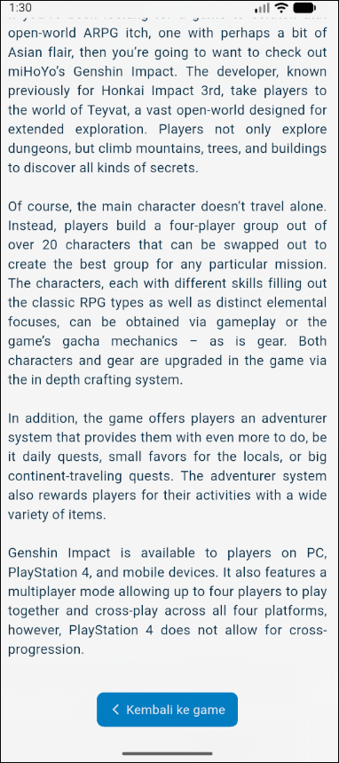

# 📱 Mobile Programming – Modul 8
**Navigasi dengan Mengirim Argumen (Data)**

## 👤 Identitas
- **Nama**: Ahmad Nashir Ulwan
- **NIM**: 230605110122
- **Kelas**: B

---

## 🎯 Tujuan
- Memahami cara mengirim data (argumen) antar halaman saat melakukan navigasi.
- Mengimplementasikan pengiriman data menggunakan `Named Route` di Flutter.
- Mampu menampilkan data yang dikirim dari satu halaman ke halaman detail lainnya, terutama data dari API.

---

## 📝 Ringkasan Tugas
Karena pada modul ini tidak ada tugas spesifik dan hanya berisi praktikum, maka ringkasan ini menjelaskan alur kerja dari praktikum yang telah dilakukan:

1.  **Struktur Proyek**: Proyek dibagi menjadi empat file: `main.dart` (konfigurasi), `home.dart` (halaman utama), `tujuan.dart` (halaman detail), dan `screen_arguments.dart` (class model untuk data).
2.  **Model Data**: Membuat sebuah class `ScreenArguments` di `screen_arguments.dart` untuk membungkus semua data (judul, subjudul, deskripsi, dll.) yang akan dikirim antar halaman agar lebih terstruktur.
3.  **Mengambil Data**: Di `home.dart`, sebuah method `getGame()` dibuat untuk mengambil detail satu game dari API FreeToGame. Method ini dipanggil di `initState()` agar data langsung dimuat saat halaman dibuka.
4.  **Mengirim Data**: Halaman utama menampilkan ringkasan info game dalam sebuah `Card`. `Card` tersebut dibungkus dengan `GestureDetector` agar bisa ditekan. Saat `onTap` (ditekan), aplikasi bernavigasi menggunakan `Navigator.pushNamed()` sambil mengirim objek `ScreenArguments` berisi data game melalui parameter `arguments`.
5.  **Menerima dan Menampilkan Data**: Di halaman `tujuan.dart`, data yang dikirim diterima menggunakan `ModalRoute.of(context)!.settings.arguments`. Data tersebut kemudian di-cast (diubah) kembali menjadi tipe `ScreenArguments` dan ditampilkan secara lengkap di halaman detail.

---

## 📸 Screenshot Hasil
Berikut adalah tampilan dari halaman utama dan halaman detail:

**Halaman Utama (Home)**

**Halaman Detail Game**

---

## ✅ Kesimpulan
- Mengirim data antar halaman di Flutter dapat dilakukan dengan efisien menggunakan properti `arguments` pada `Navigator.pushNamed`.
- Membungkus data yang akan dikirim ke dalam sebuah *class model* adalah praktik terbaik. Cara ini membuat data menjadi lebih terstruktur, mudah dikelola, dan mengurangi risiko kesalahan (*error*).
- Di halaman tujuan, data yang diterima diakses melalui `ModalRoute.of(context)!.settings.arguments` dan perlu di-*cast* kembali ke tipe data class model aslinya sebelum bisa digunakan.