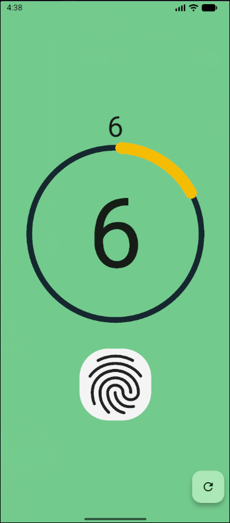

# 📱 Mobile Programming – Modul 9
**StatefulWidget dan Manajemen State Sederhana**

## 👤 Identitas
- **Nama**: Ahmad Nashir Ulwan
- **NIM**: 230605110122
- **Kelas**: B

---

## 🎯 Tujuan
- Memahami konsep dan implementasi `StatefulWidget` untuk membangun UI yang interaktif.
- Mengelola *state* (data yang bisa berubah) seperti menambah dan mereset hitungan.
- Mengintegrasikan paket eksternal (`simple_circular_progress_bar`) untuk visualisasi data yang dinamis.

---

## 📝 Ringkasan Tugas
Langkah-langkah pengerjaan tugas **Aplikasi Tasbih Digital**:

1.  **Setup Proyek**: Membuat proyek baru dan menambahkan dependensi `simple_circular_progress_bar` ke dalam file `pubspec.yaml`, lalu menjalankan `flutter pub get`.
2.  **Menggunakan StatefulWidget**: Class utama aplikasi (`MyApp`) diubah menjadi `StatefulWidget` untuk memungkinkan pengelolaan state.
3.  **Deklarasi State**: Di dalam class `_MyAppState`, variabel `_counter` (untuk menyimpan angka hitungan) dan `_valueNotifier` (untuk mengontrol progress bar) dideklarasikan dan diinisialisasi di dalam `initState()`.
4.  **Logika Fungsi**:
    -   `_incrementCounter()`: Method ini dipanggil untuk menambah nilai `_counter` (hingga maksimal 33). Di dalamnya, `setState()` dipanggil agar UI diperbarui, dan nilai `_valueNotifier` juga di-update.
    -   `_resetCounter()`: Method ini mengembalikan nilai `_counter` dan `_valueNotifier` ke 0, juga menggunakan `setState()` untuk me-render ulang UI.
5.  **Membangun Antarmuka (UI)**:
    -   `Text`: Menampilkan nilai `_counter` saat ini.
    -   `SimpleCircularProgressBar`: Menampilkan progress visual yang nilainya terikat pada `_valueNotifier`.
    -   `InkWell` dengan `Icon` sidik jari: Berfungsi sebagai tombol utama untuk memanggil `_incrementCounter()`.
    -   `FloatingActionButton`: Berfungsi sebagai tombol reset untuk memanggil `_resetCounter()`.

---

## 📸 Screenshot Hasil
Berikut adalah tampilan dari aplikasi Tasbih Digital yang telah dibuat:

**Tampilan Aplikasi Tasbih Digital**

---

## ✅ Kesimpulan
- **`StatefulWidget`** adalah komponen fundamental untuk membuat aplikasi yang UI-nya dapat berubah secara dinamis merespons interaksi pengguna.
- **`setState()`** adalah method kunci yang harus dipanggil setiap kali ada perubahan pada variabel *state*. Memanggil `setState()` akan memberitahu Flutter untuk membangun ulang (rebuild) widget, sehingga perubahan nilai dapat terlihat di layar.
- **Integrasi Paket Eksternal**: Paket seperti `simple_circular_progress_bar` yang dikontrol melalui `ValueNotifier` dapat secara signifikan meningkatkan representasi visual dari data dinamis, membuat aplikasi menjadi lebih informatif dan menarik.